This is a project of AI Sweet Shop. I have created backend using the below listed technologies:

- Node.JS

The libraries used are cors, expressJS, mongoDB.

The frontend is made using pure ReactJS. The CSS is done with the help of Tailwind CSS.

To run this project locally:

first clone the repository to your local github.
Then open the files in VS Code and then go to backend folder
In backend folder, open terminal and enter npm install - this will install all the project dependencies
Then run npm run dev to start backend
Go to frontend folder and open a new terminal
Run npm i - this will install all the dependencies
Run npm run dev

The project should be up and running now. I have also deployed it at: https://sweet-shop-sehaj.onrender.com/

First you need to register with your email id, then login with the same email and password. This will give you access as a user.

To work as admin. You can create your own admin using postman locally or you can directly use the credentials I have set up: admin@sweetshop.com password: password1

I have automatically given these credentials admin acces in the backend so you will not face any issues.

My AI Usage:

I have coressponded with ChatGPT for the entire project. I believe that AI can help us accomplish major tasks if we know how to direct it properly. First I explained the entire premise to ChatGPT of the project and then we moved step by step from there. I started working with backend first because I feel it is more direct and static. Then I moved to frontend. Whenever I faced any issues such as making the functions that were required in the backend or figuring out the project structure I used ChatGPT. I would say that I have leveraged the technology. However, the errors and bugs could not be sorted out until I had clear understanding of the code that ChatGPT gave me for some components. I have also used the VS Code in-built Microsoft copilot. It directed me at various steps as to how to move forward and made many redundant tasks very easy.

##Screenshots

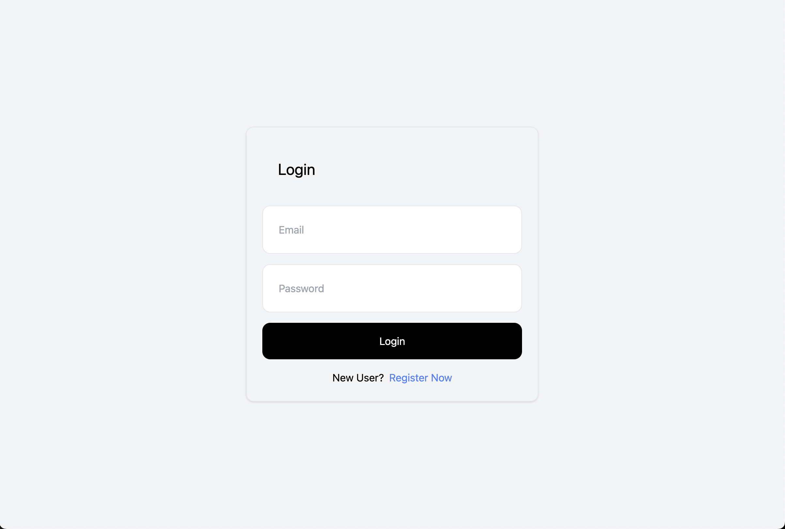
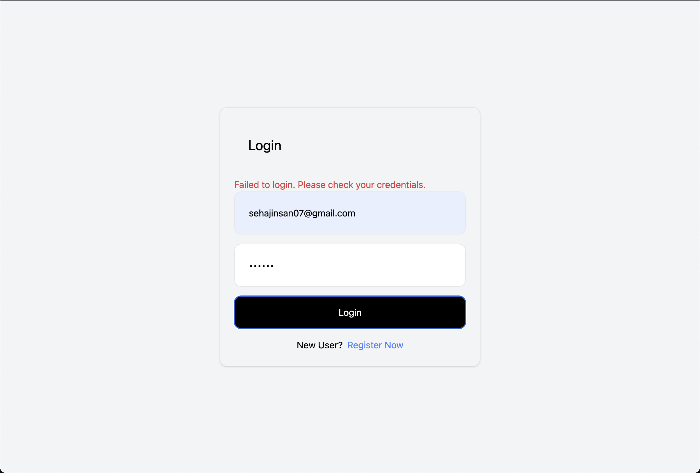
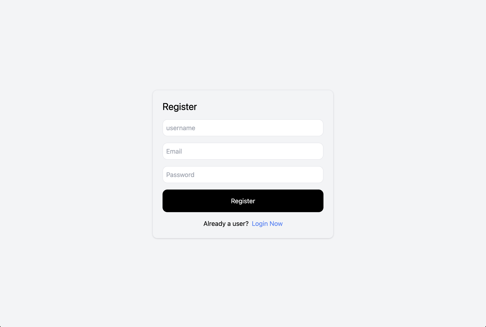
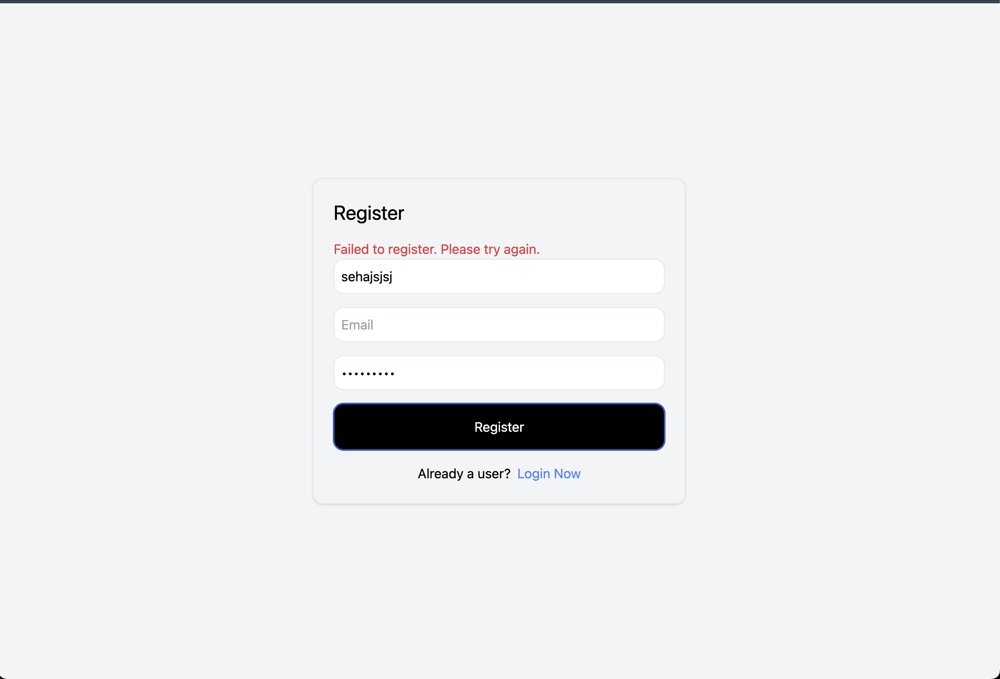
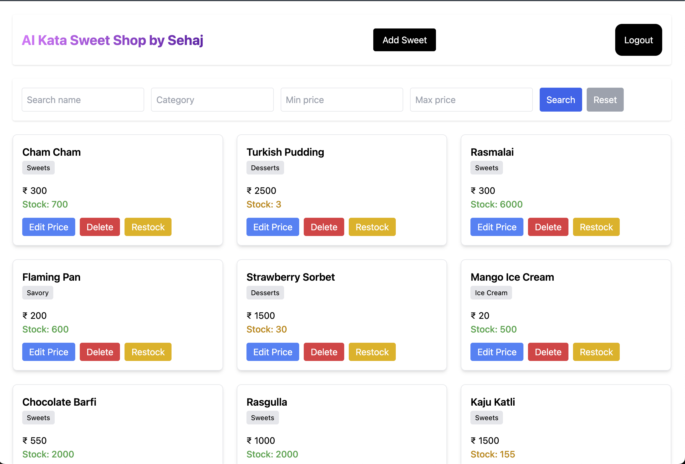
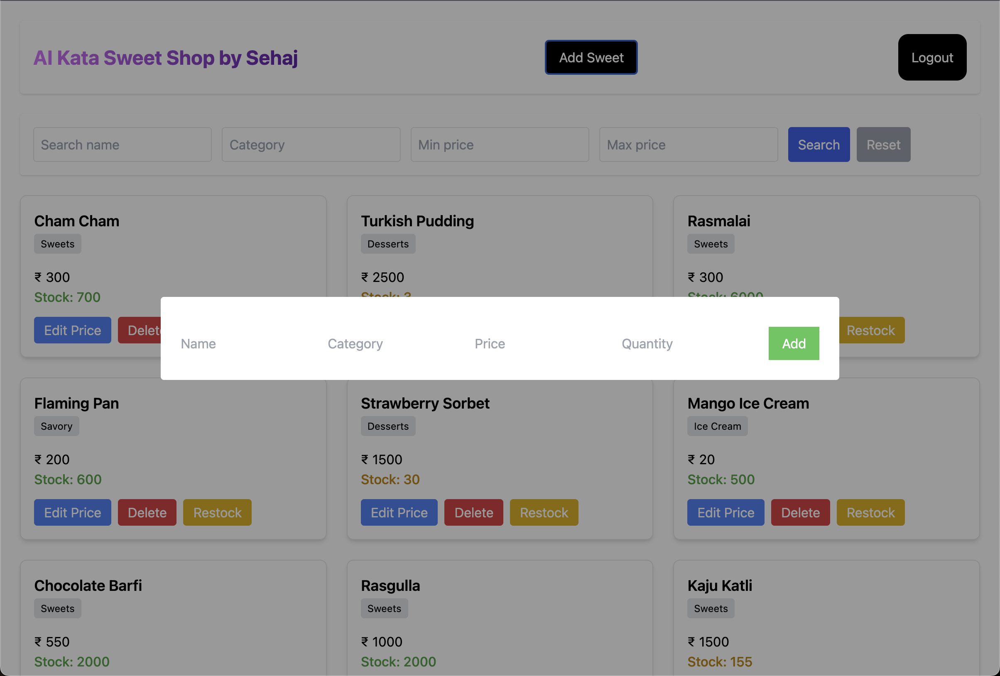
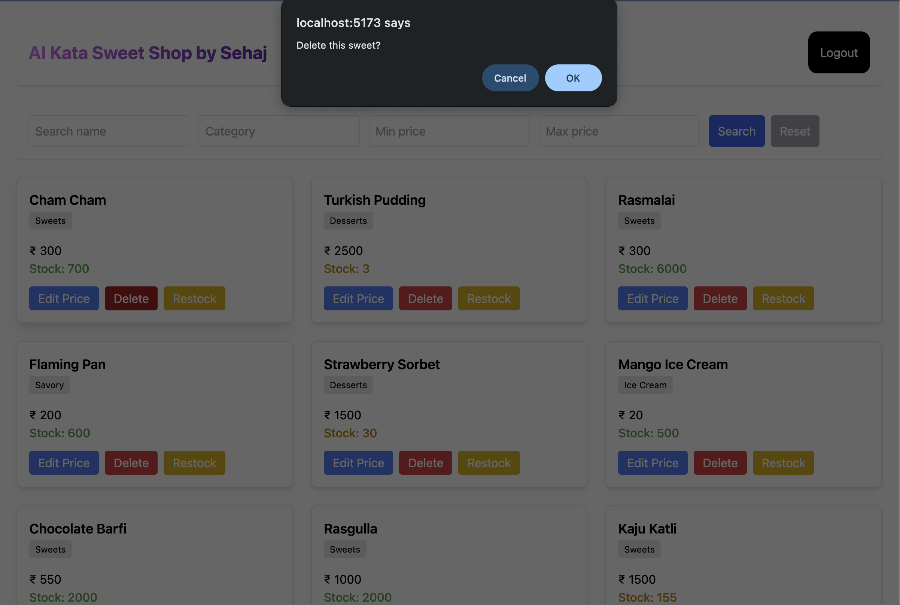
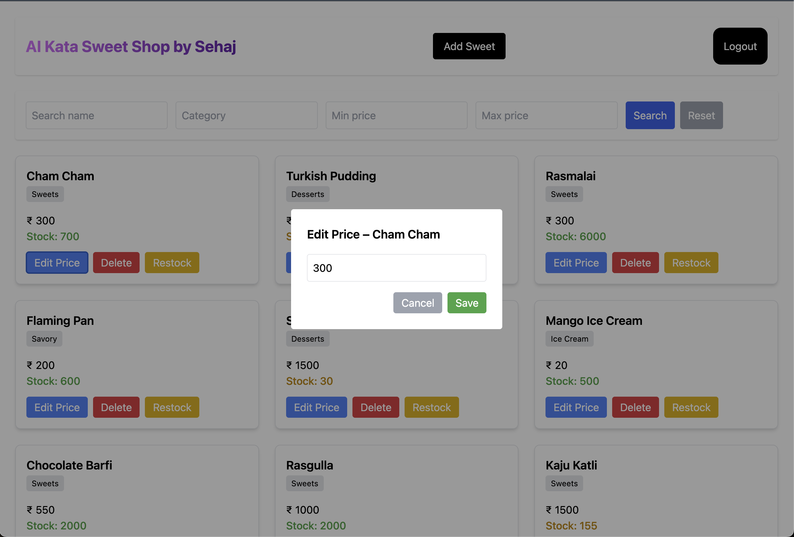
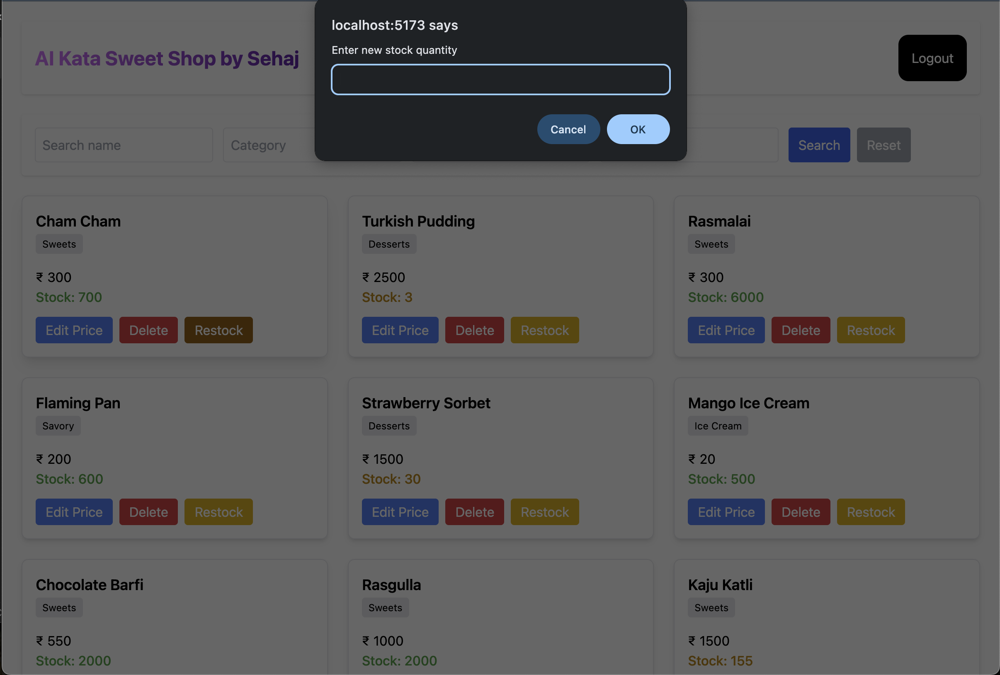
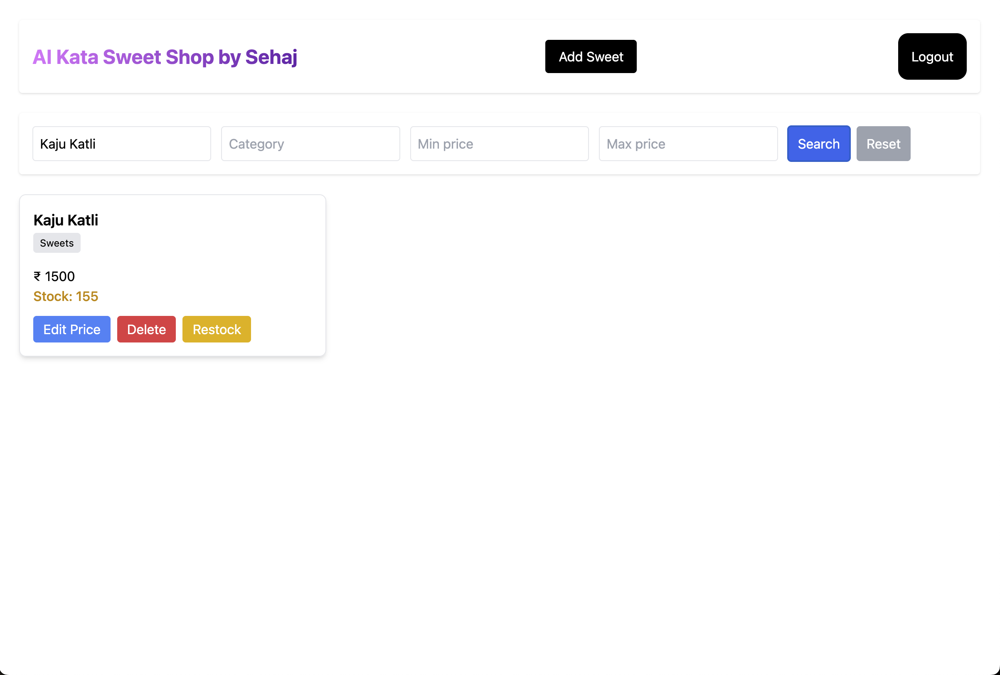
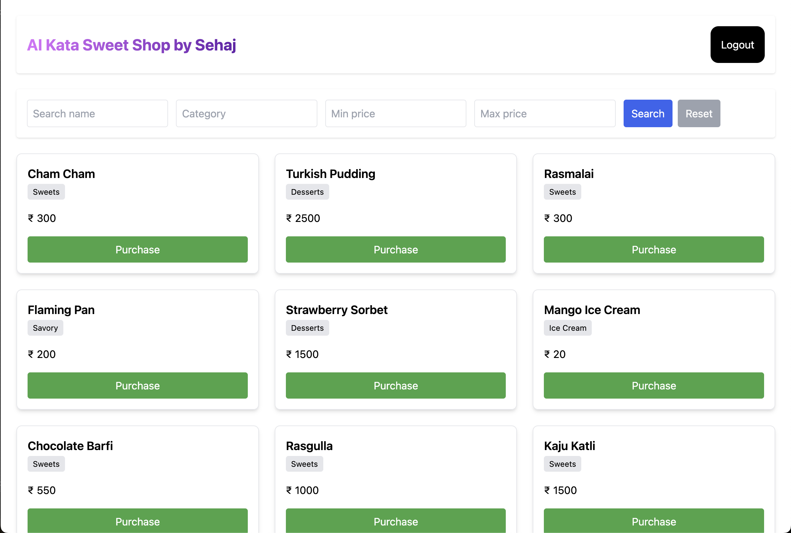
